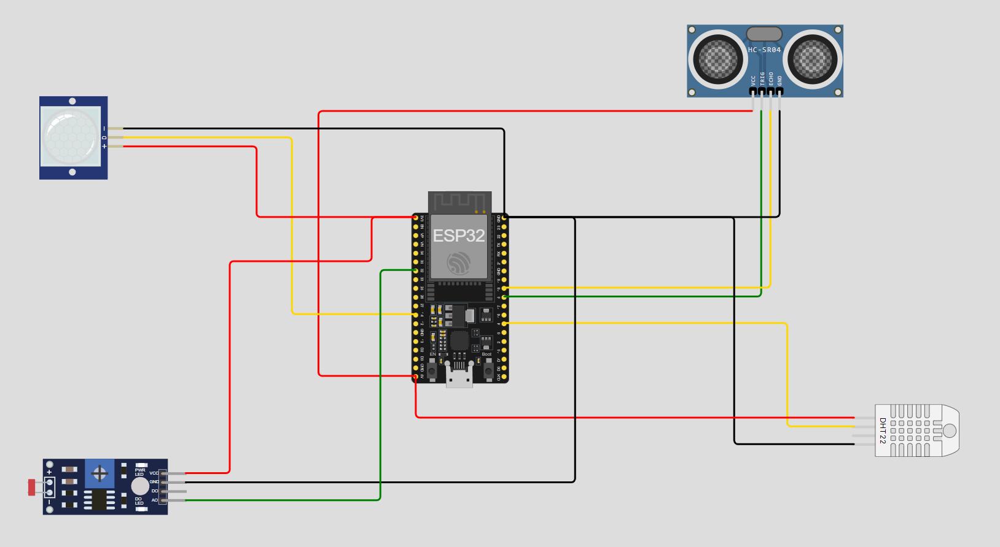

# FIAP - Faculdade de Informática e Administração Paulista

 

# Documentação do Sistema de Monitoramento Agrícola

## Integrantes

- <a href="https://www.linkedin.com/in/joseandrefilho">Jose Andre Filho</a>

## Professores

### Tutor(a)

- <a href="https://www.linkedin.com/in/lucas-gomes-moreira-15a8452a/">Lucas Gomes Moreira</a>

### Coordenador(a)

- <a href="https://www.linkedin.com/in/profandregodoi/">André Godoi Chiovato</a>

## Descrição Geral do Sistema

O sistema utiliza quatro sensores conectados ao ESP32 para monitorar variáveis ambientais em uma fazenda, permitindo a automação de irrigação e a vigilância de segurança. O sistema coleta dados de temperatura, umidade, nível de água, luminosidade e presença de movimento, ajustando dinamicamente a quantidade de água com base na temperatura, umidade, luminosidade e nível de água no reservatório.

### Sensores Utilizados

1. **DHT22 (Sensor de Temperatura e Umidade):**
   - Mede a temperatura e umidade do ambiente. Esses dados são fundamentais para o controle da irrigação, evitando desperdícios e otimizando a quantidade de água usada nas plantas.

2. **HC-SR04 (Sensor de Ultrassom):**
   - Mede a distância até a superfície da água em um reservatório. O sistema utiliza essa medida para garantir que a irrigação só ocorra se houver água suficiente disponível no tanque.

3. **PIR (Sensor de Movimento):**
   - Detecta a presença de animais ou pessoas em áreas monitoradas, sendo útil para a segurança e a vigilância da fazenda.

4. **LDR (Sensor de Luz):**
   - Monitora a intensidade da luz solar, permitindo ajustar a quantidade de água usada na irrigação. Em dias ensolarados, a irrigação é reduzida, e em dias nublados ou com baixa luminosidade, a irrigação é aumentada.

### Desenho do Circuito

O diagrama abaixo ilustra a conexão dos sensores ao microcontrolador ESP32:

### Funcionalidades Implementadas

1. **Monitoramento Climático:**
   - O sensor DHT22 coleta dados de temperatura e umidade, ajustando a irrigação de acordo com as condições climáticas.

2. **Controle Automatizado de Irrigação:**
   - O sensor HC-SR04 monitora o nível de água no reservatório e aciona a irrigação apenas quando há água disponível.

3. **Vigilância e Segurança:**
   - O sensor PIR detecta movimento em áreas monitoradas e pode ativar alarmes ou registrar presença no sistema.

4. **Ajuste de Irrigação por Luminosidade:**
   - O sensor LDR mede a intensidade da luz solar e ajusta automaticamente a irrigação, utilizando mais água em dias nublados e menos em dias ensolarados.

# Regras Funcionais Implementadas

## 1. Detecção de Movimento (PIR)

- **Regra**: Se o sensor PIR detectar movimento de pessoas ou animais, a irrigação será **interrompida imediatamente** por razões de segurança.
- **Condição**: Se `movimento == HIGH`, a irrigação é cancelada e uma mensagem é exibida no Monitor Serial.

## 2. Verificação da Umidade (DHT22)

- **Regra**: Se a umidade estiver **abaixo de 40%**, o sistema avalia a necessidade de ativar a irrigação. Se a umidade estiver **acima ou igual a 40%**, a irrigação **não será necessária**.
- **Condição**: Se `umidade < 40`, a função procede com a verificação de temperatura e luminosidade para ajustar a irrigação. Caso contrário, exibe a mensagem "Umidade adequada, irrigação não necessária".

## 3. Avaliação da Temperatura (DHT22)

- **Regra**: Dependendo da temperatura medida, diferentes níveis de irrigação são ativados:
  - Se a temperatura estiver entre **24ºC e 30ºC** (faixa ideal), o sistema avalia a **luminosidade** para ajustar a intensidade da irrigação.
  - Se a temperatura for **maior que 30ºC**, o sistema também avalia a **luminosidade** para determinar o nível de irrigação.
  - Se a temperatura estiver **abaixo de 24ºC**, a irrigação será **leve**.

## 4. Avaliação da Luminosidade (LDR)

- **Regra**: A intensidade da irrigação é ajustada com base na **luminosidade** medida pelo sensor LDR:
  - **Alta luminosidade** (valor maior que 500): O sistema considera o dia como **ensolarado** e ativa uma irrigação mais intensa.
  - **Baixa luminosidade** (valor menor ou igual a 500): O sistema considera o dia como **nublado** e ativa uma irrigação mais leve.

## 5. Ativação da Irrigação (HC-SR04)

- **Regra**: A irrigação será ativada apenas se houver **água suficiente** no reservatório. O volume de água necessário é calculado com base na **temperatura** e **luminosidade**:
  - Para dias ensolarados com temperatura ideal, **20 cm de água** são necessários.
  - Para dias nublados com temperatura ideal, **10 cm de água** são suficientes.
  - Para dias ensolarados com temperatura alta, **25 cm de água** são necessários.
  - Para dias nublados com temperatura alta, **15 cm de água** são necessários.
  - Em temperaturas baixas (abaixo de 24ºC), **10 cm de água** são necessários.
- **Condição**: Se `nivelAgua >= aguaNecessaria`, a irrigação é ativada. Caso contrário, a irrigação é cancelada com uma mensagem informando a insuficiência de água.

## 6. Mensagens Informativas

- **Regra**: Para cada decisão tomada pelo sistema (ativação, cancelamento ou ajuste de irrigação), uma mensagem detalhada é exibida no Monitor Serial. Isso permite acompanhar em tempo real as condições ambientais e as ações tomadas pelo sistema.

# Resumo das Condições Implementadas

1. Se houver movimento detectado, a irrigação é cancelada.
2. Se a umidade for superior a 40%, a irrigação não é necessária.
3. Se a temperatura estiver na faixa ideal (24ºC a 30ºC), a irrigação é ajustada com base na luminosidade (leve em dias nublados, intensa em dias ensolarados).
4. Se a temperatura for maior que 30ºC, a irrigação é intensificada, e a luminosidade é usada para ajustar o volume de água.
5. Se a temperatura for baixa (abaixo de 24ºC), a irrigação é leve, independente da luminosidade.
6. Se o nível de água no reservatório for insuficiente para a irrigação necessária, a irrigação é cancelada.
