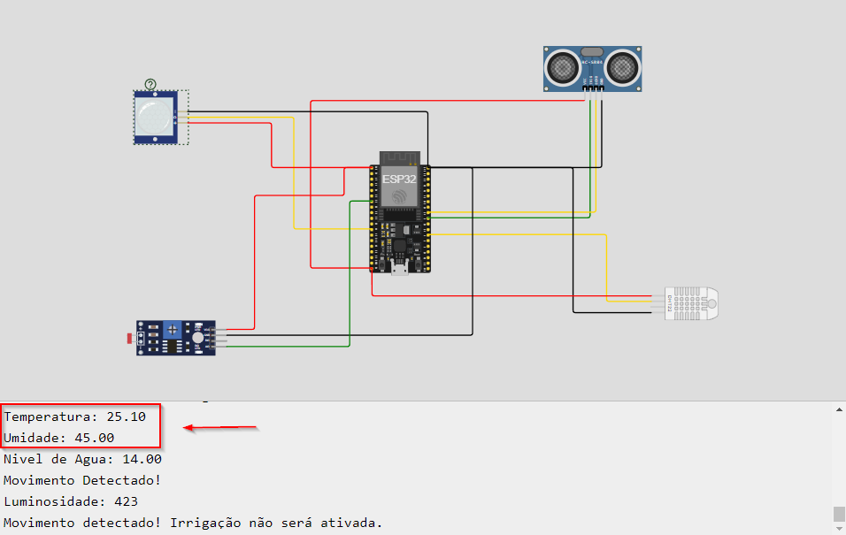
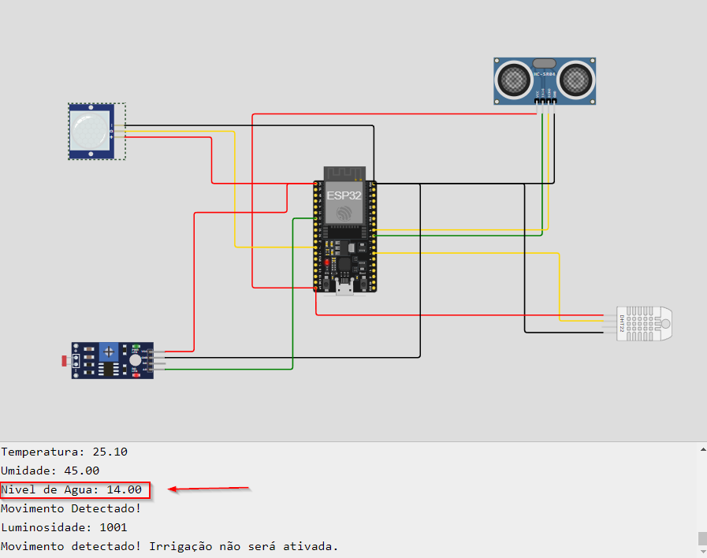
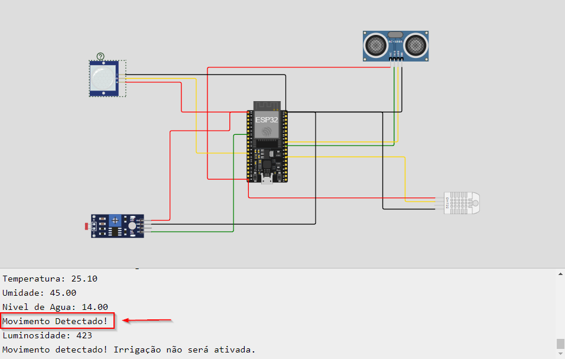
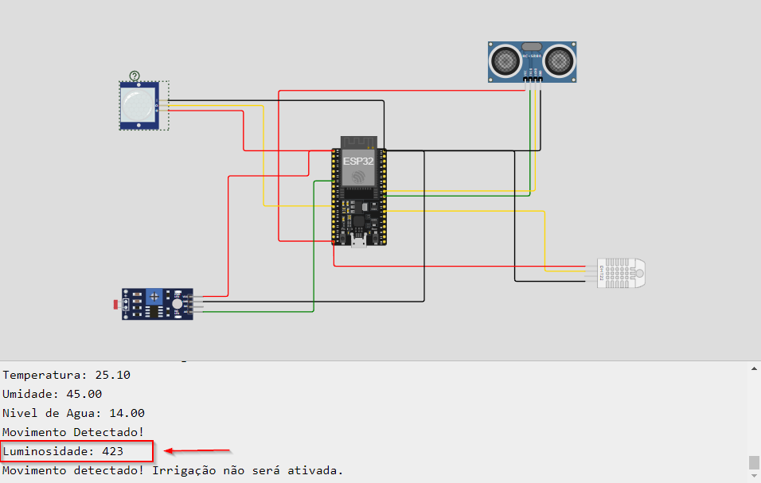
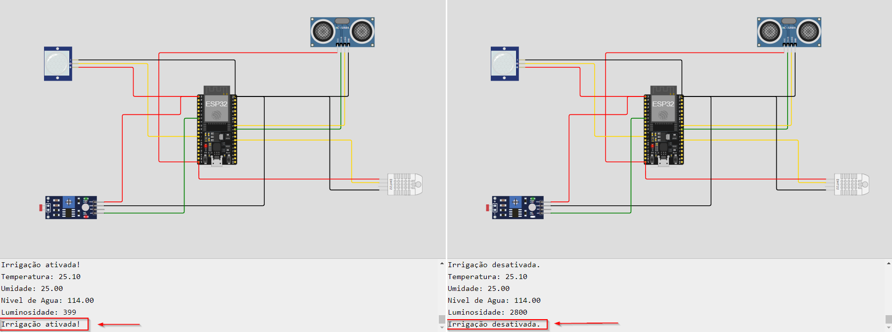

# FIAP - Faculdade de Informática e Administração Paulista

<p align="center">
<a href= "https://www.fiap.com.br/"></a>
</p>

<br>

# Testes do Sistema de Monitoramento Agrícola

## Integrantes

- <a href="https://www.linkedin.com/in/joseandrefilho">Jose Andre Filho</a>

## Professores

### Tutor(a)

- <a href="https://www.linkedin.com/in/lucas-gomes-moreira-15a8452a/">Lucas Gomes Moreira</a>

### Coordenador(a)

- <a href="https://www.linkedin.com/in/profandregodoi/">André Godoi Chiovato</a>

Este diretório contém informações sobre os testes realizados para validar o funcionamento dos sensores e a automação do sistema de irrigação.

## Testes Realizados

### 1. **DHT22 (Temperatura e Umidade)**

- O sensor DHT22 foi testado para garantir que mede corretamente a temperatura e a umidade do ambiente.
- O teste foi realizado monitorando os valores recebidos pelo Monitor Serial.

   **Exemplo de saída no Monitor Serial:**

   ```plaintext
   Temperatura: 25.10
   Umidade: 45.00
   ```

   **Print do Monitor Serial:**
   

### 2. **HC-SR04 (Nível de Água)**

- O sensor ultrassônico HC-SR04 foi testado para medir corretamente a distância até o nível de água no reservatório.

   **Exemplo de saída no Monitor Serial:**

   ```plaintext
   Nível de Água: 14.00
   ```

   **Print do Monitor Serial:**
   

### 3. **PIR (Sensor de Movimento)**

- O sensor PIR foi testado para detectar a presença de movimento de pessoas ou animais.

   **Exemplo de saída no Monitor Serial:**

   ```plaintext
   Movimento Detectado!
   ```

   **Print do Monitor Serial:**
   

### 4. **LDR (Sensor de Luminosidade)**

- O sensor de luminosidade LDR foi testado para garantir que a quantidade de água usada na irrigação seja ajustada conforme a intensidade de luz solar recebida.

   **Exemplo de saída no Monitor Serial:**

   ```plaintext
   Luminosidade: 1001
   ```

   **Print do Monitor Serial:**
   

### 4. **Função controlarIrrigacao**

- A função `controlarIrrigacao` foi testada para garantir que a irrigação seja ativada corretamente quando não for detectado movimento, a umidade estiver abaixo de 40%, nivel de água no reservatório for acima de 10% e a luminosidade for maior que 500.

   **Exemplo de saída no Monitor Serial:**

   ```plaintext
   Movimento detectado! Irrigação não será ativada.
   Irrigação ativada!
   Irrigação desativada.

   ```

**Print do Monitor Serial:**
   
---

Esses testes garantem o correto funcionamento de todos os sensores e das decisões automatizadas tomadas pelo sistema. Cada teste foi validado com base nas leituras apresentadas no Monitor Serial.
